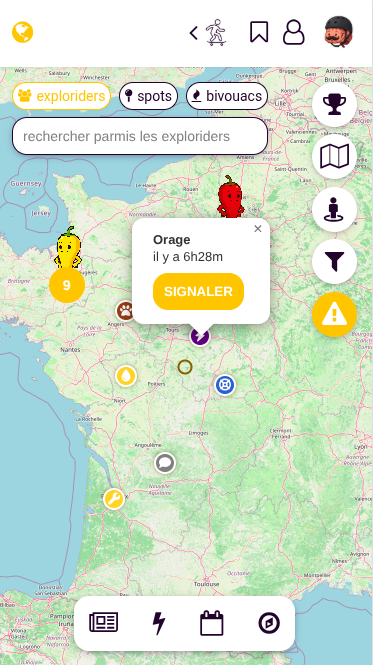
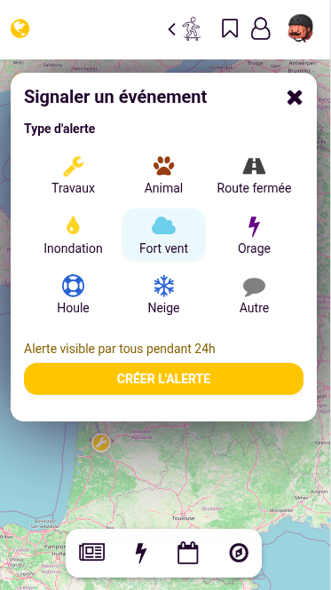
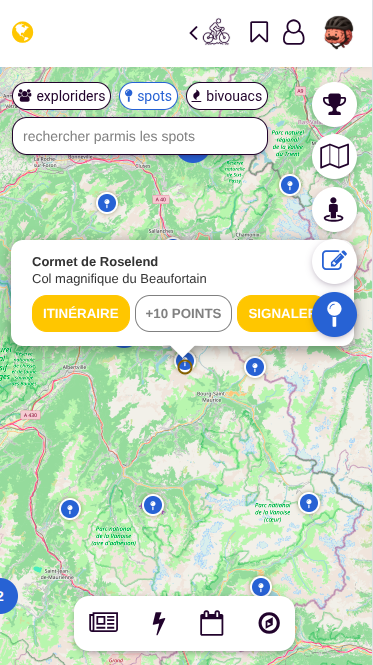
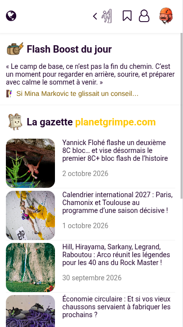
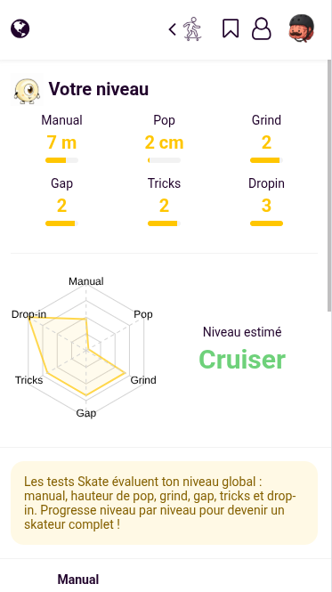
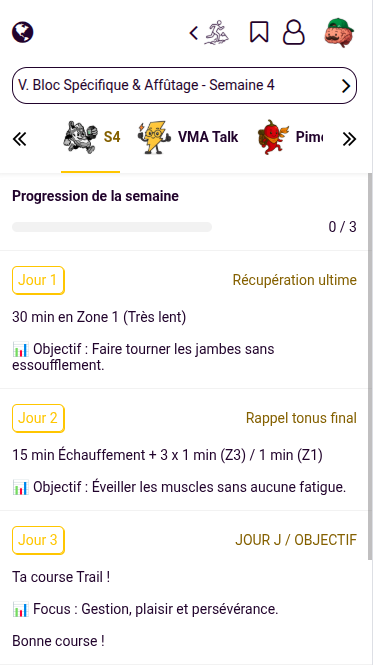
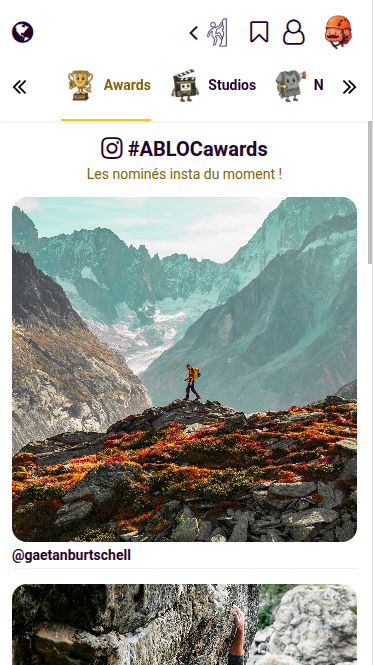
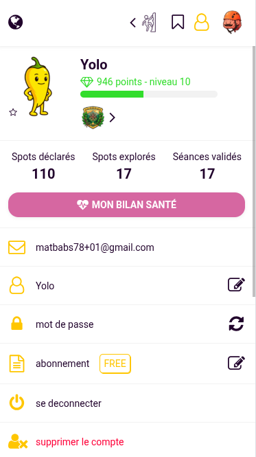
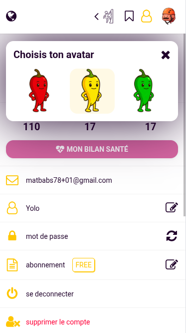
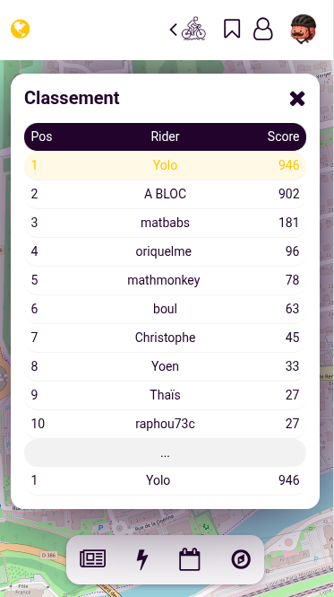

# 🏔️ DOSSIER PRODUIT & FICHE DE VENTE : *ABLOC* -> Waze x Snap
*L'alliance de la sécurité collaborative, de la technologie sans friction et de la culture outdoor.*

---

## 🤝 LE SOCLE : UNE COMMUNAUTÉ SOLIDAIRE POUR LA SÉCURITÉ DE TOUS

L'outdoor et la montagne reposent sur une valeur universelle : **l'esprit de cordée**. Sur le terrain, la sécurité n'est pas individuelle, elle dépend de la vigilance collective.

* **La force du nombre :** Aucun organisme météo ou gestionnaire de parc ne peut surveiller chaque couloir, chaque sentier ou chaque point d'ancrage en temps réel. **Les sentinelles, ce sont les pratiquants eux-mêmes.**
* **L'entraide bienveillante (Trust & Care) :**
  * Un grimpeur qui prévient d'une écaille instable sauve potentiellement la vie de la cordée suivante.
  * Un skieur de rando qui signale une plaque friable sécurise les traces de l'après-midi.
  * Un traileur qui pointe un troupeau avec patous évite un accident à un randonneur en famille.
* **(Système de Réputation) :** Un statut valorisant les sportifs qui protègent la communauté et confirment la validité des alertes pour maintenir une carte fiable et à jour. → *Implémenté via le système de points et leaderboard*

---

## 1. Signalement Multi-Sports (Zéro friction sur le terrain) ✅ FAIT

### ✅ Phase 1 — Smartphone (Déployé)

* **Alertes en temps réel :** 4 types d'alertes disponibles (Danger, Faune, Eau, Personnalisé)
  * *Ski :* Alertes danger, conditions dangereuses
  * *Escalade :* État des points d'ancrage, rocher instable
  * *Trail / Vélo :* Patous, chasse, sentiers coupés

### ⏳ Phase 2 — Écosystème Montres & Wearables (Objectif 2 ans)
* **Widget 2 clics (adapté aux gants de ski / vélo) :** 4 gros boutons intuitifs :
  1. *Danger / Sentier coupé / Chute de pierres / Plaque à vent*
  2. *Faune / Chasse / Patou / Nidification*
  3. *Eau / Ravitaillement / État du refuge*
  4. *Note vocale rapide*
* **Bouton physique (Apple Watch Ultra / Garmin) :** Appui long pour poser un repère instantané au relais en falaise ou en pleine descente de ski, à qualifier à l'arrivée.

### ⏳ Phase 3 — Contrôle Vocal & Écouteurs (Objectif 3 ans)
* Commandes natives (*« Dis Siri, signale une coulée de neige sur ABLOC »*).
* Note vocale de 5 secondes au double-tap d'écouteur : l'IA catégorise automatiquement (*ex. « Relais du secteur Grande Face desserré »* → catégorie *Escalade / Matériel défectueux*).

---

## 2. Le Cœur Social (Snap Map & Live Outdoor) ✅ FAIT

* **Carte Sociale Vivante 2D :** Cartographie enrichie avec visualisation en direct de la communauté (ExploRiders) et des zones à risques. → *Implémenté via le filtre "ExploRiders" sur la carte*
* **Live Spot Stories (12h à 24h) :** *À implémenter*
  * *Ski :* Vidéo de l'état de la neige fraîche dans un couloir filmée 30 min plus tôt.
  * *Escalade :* Photo de la falaise à 9h pour vérifier si elle est à l'ombre ou si les voies sont trempées.
  * *Trail / Vélo :* Ambiance météo au col.
* **Livre d'Or Digital :** *À implémenter*
  * Signer numériquement la croix du sommet en ski de rando.
  * Valider une voie en falaise avec un mot d'encouragement ou une astuce de mouvement ("crux") pour les suivants.

---

## 3. Les Pages Secondaires Déclinées

### 📰 1. Actualités Outdoor & Montagne ✅ FAIT

* **La Gazette :** Flux RSS multi-sources par sport → *Implémenté sur la page Home*
* BERA (Bulletin d'Estimation du Risque d'Avalanche) → *À intégrer*
* Arrêtés falaise (arrêtés biotope / nidification faucon pèlerin) → *À intégrer*
* Battues de chasse, météo des sommets et ouvertures de cols/remontées → *À intégrer*

### 🎯 2. Tests de Niveaux Dédiés ✅ FAIT

* **Escalade :** Évaluation de la cotation max à vue/après travail, autonomie manips de corde/relais, maîtrise du rappel. → *Implémenté (doigts, traction, gainage, suspension)*
* **Ski (Rando & Freeride) :** Niveau technique en pente raide, autonomie DVA/pelle/sonde, lecture du manteau neigeux. → *À implémenter*
* **Trail / Rando :** VMA ascensionnelle, endurance en pierrier. → *Implémenté (VMA, VAM, sprint)*
* **VTT / Gravel :** Franchissement d'obstacles, maniabilité technique en descente. → *Implémenté (3min, 12min, sprint → CP, W', LT1)*
* **Skate :** Manual, pop, grind, gap, tricks, drop-in → *Implémenté*

### 📈 3. Cycles d'Entraînement & Exercices ✅ FAIT

* **4-5 cycles par sport** avec sélection de semaine → *Implémenté*
* Sous-onglets : Sessions, Talk (crux), Story, Health, Report → *Implémenté*
* Préparation physique spécifique :
  * *Escalade :* Suspensions sur poutre, gainage inversé, mobilité épaules/doigts.
  * *Ski de rando :* Renforcement quadriceps excentrique, travail cardio en montée continue.
  * *Trail / Vélo :* Endurance fondamentale, renforcement chevilles/genoux.

### 🏕️ 4. Basecamp (Le Hub Réseaux & Tribus) ✅ FAIT

* **Studios :** Créateurs de contenu avec stats → *Implémenté*
* **Awards :** Nominations Instagram → *Implémenté*
* **Shops :** Équipementiers (Nival, Baroudeur, SkateDeluxe, Cimalp) → *Implémenté*
* **Tribus :** Trouver des partenaires de cordée selon le niveau → *À implémenter*
* Découvrir les meilleurs créateurs, topos et vidéos d'aventure du moment. → *Implémenté*

### 🏆 5. Gamification & Récompenses ✅ FAIT

* **Leaderboard :** Classement par points → *Implémenté*
* **Système de points :**
  * +10 points : Visite d'un marker
  * +20 points : Ajout d'un marker
  * +30 points : Création d'alerte
* **Récompenses :** Confetti, popup de points, niveaux de grade → *Implémenté*
* **Badges & titres :** *À implémenter*

---

# 🚀 FICHE DE VENTE & POSITIONNEMENT STRATÉGIQUE

---

### 1. La Proposition de Valeur Unique (UVP)
> **« Le Waze des sports outdoor : une communauté de passionnés unis pour la sécurité, l'information en direct et l'esprit d'aventure de chacun. »**

---

### 2. Argumentaires de Vente par Profil Sportif

| Sport | Le problème sans l'app | Le bénéfice immédiat avec la communauté ABLOC |
| :--- | :--- | :--- |
| **🧗 Escalade** | Arriver au pied d'une falaise détrempée, interdite pour nidification ou avec un point rouillé. | Partir serein : la communauté remonte l'état de l'équipement, la fréquentation et la sécheresse du rocher le matin même. |
| **⛷️ Ski (Rando / Freeride)** | Partir avec des topos obsolètes et douter de la stabilité de la neige ou de l'enneigement réel. | Bénéficier de la vigilance partagée : couloirs tracés, zones glacées et alertes plaques signalées par les premiers partis. |
| **🏃 Trail / Rando** | Tomber sur un patou agressif, une battue de chasse surprise ou un sentier emporté. | Contourner les imprévus grâce aux alertes posées vocalement par les runners passés quelques minutes avant toi. |
| **🚴 VTT / Gravel** | Arriver pleine vitesse sur un arbre en travers du single ou une piste défoncée par des travaux forestiers. | Rouler en confiance avec des avertissements audio et visuels synchronisés sur ta montre par les autres riders. |
| **🛹 Skate** | Ne pas connaître les spots, leurs difficultés et les tricks à maîtriser. | Découvrir les spots locaux, leur niveau et les tricks à travailler. |

---

### 3. Argumentaire B2B (Partenaires, Stations, Parcs Naturels & Secours)

* **Pour les Acteurs Publics & Secours en Montagne :**
  * *Argument :* Prévention active des accidents grâce à la sensibilisation en temps réel et réduction des interventions d'urgence grâce à la responsabilisation collective des usagers.
* **Pour les Stations de Ski & Domaines de Montagne :**
  * *Argument :* Un outil moderne d'auto-régulation pour sécuriser le hors-piste/rando et protéger les zones naturelles sensibles.
* **Pour les Marques Outdoor & Équipementiers :**
  * *Argument :* S'associer aux valeurs les plus nobles de la montagne : solidarité, engagement et sécurité partagée.

---

## 📊 État des lieux

| Fonctionnalité | Status |
| :--- | :--- |
| Signalement (alertes 24h) | ✅ FAIT |
| Carte sociale (ExpoRiders) | ✅ FAIT |
| Leaderboard & Points | ✅ FAIT |
| Tests de niveaux | ✅ FAIT |
| Cycles d'entraînement | ✅ FAIT |
| Actualités (Gazette) | ✅ FAIT |
| Basecamp (Studios/Shops) | ✅ FAIT |
| Stories (contenu) | ✅ FAIT |
| Live Spot Stories | ⏳ À développer |
| Livre d'Or Digital | ⏳ À développer |
| BERA & arrêtés | ⏳ À développer |
| Wearables (Phase 2) | ⏳ Future |
| Voice control (Phase 3) | ⏳ Future |
| Tribus (partenaires) | ⏳ À développer |