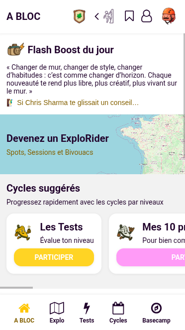
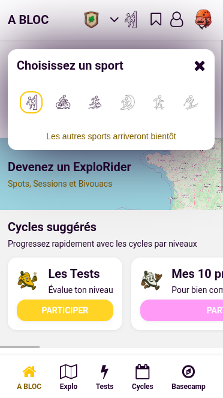
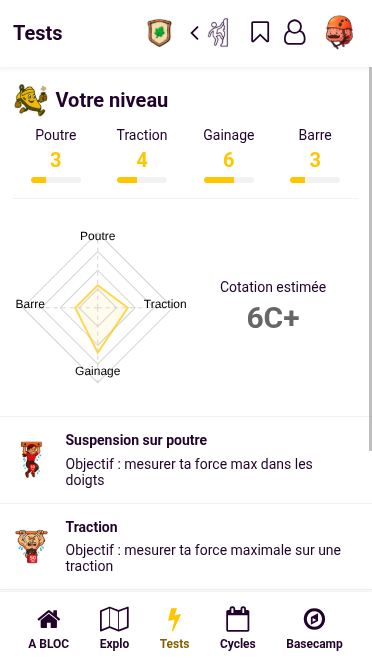
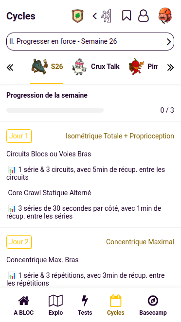
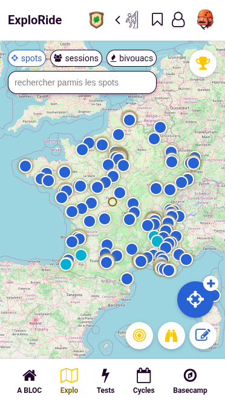
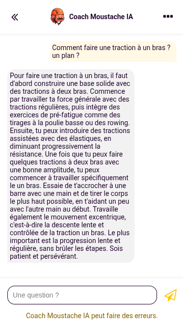
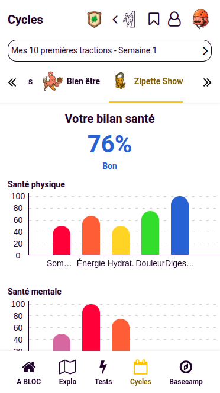
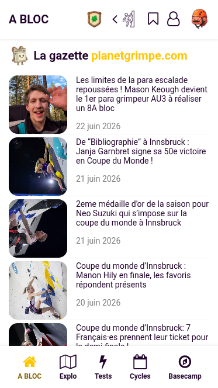
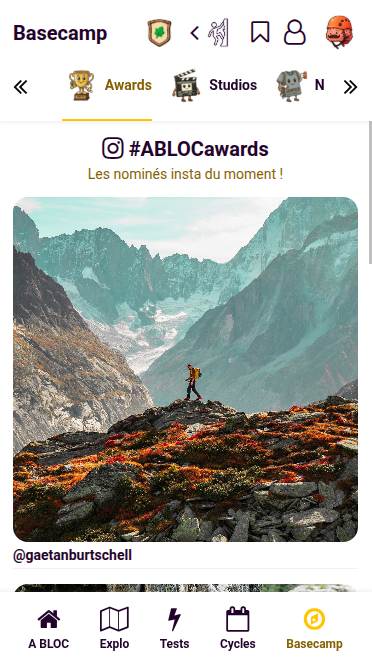

# A BLOC — L'application des ExploRiders sans limites

> **Explore. Challenge-toi. Depasse-toi.**

---

## Qu'est-ce que A BLOC ?

**A BLOC** est l'application de training multi-sport pour les aventuriers qui refusent les limites. Que tu sois grimpeur, graveliste ou traileur, A BLOC te propose des programmes structures, un suivi intelligent et une communaute vivante — tout ce qu'il faut pour progresser, chaque jour.

---

## Pourquoi A BLOC ?

|                | Les autres apps           | A BLOC                                         |
| -------------- | ------------------------- | ---------------------------------------------- |
| **Programmes** | Generiques, un seul sport | 3 sports complets avec cycles progressifs      |
| **Suivi**      | Simple compteur           | Tests physiques, bilan sante, rapport hebdo    |
| **Communaute** | Classement basique        | Carte interactive, leaderboard, grades, awards |
| **Coaching**   | Aucun ou generique        | IA Coach Moustache, expert par sport           |
| **Contenu**    | Statique                  | 200+ seances, RSS, tutos YouTube               |
| **Sante**      | Optionnel                 | Bilan sante complet avec 17 indicateurs        |

---

## Fonctionnalites

### 1. Multi-Sport — 3 univers, une seule app

- **Escalade / Bloc** — Le sport fondateur. Tests de force, cycles de 8 a 63 semaines, programmes du debutant au performanceur.
- **Gravel / Bikepacking** — Puissance critique, seuil lactique, reserve anaerobie. 5 cycles de 4 semaines pour maitriser la route et les chemins.
- **Trail** — VMA, denivele, sprint. 5 cycles pour conquerir les cretes.
- **3 sports a venir** — Surf, Skate, Ski. L'application evolue avec tes passions.
- **Basculement instantane** — Change de sport en un tap. Toute l'app s'adapte : contenu, tests, icons, vocabulaire.

---

### 2. Tests Physiques — Connais-toi, mesure-toi

#### Escalade (4 tests, score 0-10)

- Suspension sur poutre — Force maximale des doigts
- Traction — Force dorsale et bras
- Gainage suspendu — Stabilite du corps en suspension
- Suspension sur barre — Endurance avant-bras/epaules
- **Estimation de cote** automatique : de <5A a 9C, avec radar chart

#### Gravel (3 tests, watts)

- Test 3 min — Puissance anaerobie
- Test 12 min — Puissance aeroe
- Pmax (1s) — Puissance maximale
- **3 metriques calculees** : Puissance Critique (CP), Seuil Lactique 1 (SL1), Reserve Anaerobie (W')
- Radar chart des percentages

#### Trail (3 tests)

- VMA 6 min — Vitesse Maximale Aerobie
- VAM 6 min — Capacite de denivele
- Sprint 100m — Vitesse explosive
- Radar chart des scores

> Chaque test est sauvegarde, visualise en radar chart, et sert de base a ton entrainement.

---

### 3. Cycles d'Entrainement — Des programmes qui construisent la performance

#### Escalade — 6 cycles progressifs

1. **Mes 10 premieres tractions** (8 sem.) — De 0 a 10 tractions
2. **Traction a un bras** (3 sem.) — Le graal de la force
3. **Debuter une prepa grimpe** (24 sem.) — Les fondamentaux
4. **Progresser en force** (11 sem.) — Developpement maximal
5. **Performer en bloc** (9 sem.) — Specialisation
6. **Du bloc vers la voie** (19 sem.) — Transition et endurance

#### Gravel — 5 cycles de 4 semaines

1. Notions cles en bikepacking
2. Bloc Endurance
3. Bloc Puissance Critique
4. Bloc Vo2max / PMA
5. Bloc Sprint / Force Max

#### Trail — 5 cycles de 4 semaines

1. Fondations du Traileur
2. Bloc Denivele & Force
3. Bloc Seuil & Relance
4. Bloc VMA & Densite
5. Bloc Specifique & Affutage

> **200+ seances** avec contenus HTML riches, exercices, series, repos, et tutos YouTube integres.

---

### 4. Progression & Validation — Chaque seance compte

- **Valider une seance** = marquer ton engagement. Un check, un confetti, des points.
- **Barre de progression** par semaine — vois ton avancement en un coup d'oeil.
- **Navigation par swipe** — glisse entre les semaines, fluide et naturel.
- **Selecteur de cycle** — vue d'ensemble avec statut couleur (vert = semaine completee).
- **Session decouverte (WOD)** — l'app te propose une seance aleatoire. Sors de ta routine.
- **Carrousel de cycles** — sur la Home, decouvre les programmes et participe en un tap.
- **Reprise automatique** — l'app te renvoie a ton dernier cycle.

---

### 5. Carte Interactive ExploRide — Decouvre, partage, explore

- **Carte Leaflet temps reel** avec geolocalisation GPS continue.
- **3 types de marqueurs** :
    - **Spots** (bleu) — Les spots grimpe, gravel, trail a partager (3 max)
    - **Sessions** (vert) — Organise une seance collective avec date/heure (1 max)
    - **Bivouacs** (rouge) — Partage tes spots de bivouac (1 max)
- **Ajout de marqueurs** — Nom, description, coordonnees, date/heure, contact.
- **Protection anti-spam** — Pas de marqueur a moins de 50m d'un marqueur existant.
- **Recherche de marqueurs** — Filtre par nom ou description.
- **Visite de marqueurs** — Clique "visiter", le marqueur change d'apparence, +10 points.
- **Signalement** — Un marqueur inapproprie ? Signale-le. Notification admin automatique.
- **Vue satellite** — Bascule entre carte et satellite.
- **Ouvrir dans GPS** — Deep link vers Google Maps, Waze ou l'app native.
- **Chargement optimise** — Marqueurs charges par batch de 500.

---

### 6. Leaderboard & Gamification — La motivation par le depassement

- **Systeme de points** :
    - Visiter un marqueur : **+10 pts**
    - Valider une seance : **+3 pts**
    - Devalider une seance : **-3 pts**
- **10 grades progressifs** :

| Grade       | Icone |
| ----------- | ----- |
| Novice      |       |
| Apprenti    |       |
| Rodeur      |       |
| Baroudeur   |       |
| Aventurier  |       |
| Guide       |       |
| Survivant   |       |
| Conquerant  |       |
| Explorateur |       |
| **Legende** |       |

- **Classement global Top 10** + ta position
- **Barre XP** vers le grade suivant
- **Badges de distinction** affiches sur ton profil

---

### 7. Coach Moustache — Ton IA de coaching sportif

- **Intelligence artificielle Gemini** via Firebase Vertex AI
- **3 personnalites sportives** :
    - **Escalade** — Expert en bloc, voie, alpinisme. Technique, force, strategie.
    - **Gravel** — Expert en bikepacking, endurance, equipement, nutrition.
    - **Trail** — Expert en trail/ultra. Denivele, descente, batons, nutrition.
- **Chat interactif** — Pose tes questions, recois des conseils personnalises.
- **Historique persiste** — Tes conversations sont sauvegardees par sport.
- **Filtre anti-erreur** — Mention legale : "Coach Moustache IA peut faire des erreurs"

> Un coach dans ta poche, disponible 24/7, specialise dans ton sport.

---

### 8. Bilan Sante — 17 indicateurs pour une vision complete

Un questionnaire progressif (chaque reponse revele la question suivante) qui analyse :

| Dimension             | Indicateurs                             |
| --------------------- | --------------------------------------- |
| **Profil**            | Age, taille, poids (IMC auto), objectif |
| **Alimentation**      | Petit-dejeuner, hydration               |
| **Sommeil**           | Qualite, suffisance                     |
| **Energie & Stress**  | Niveau d'energie quotidien, stress      |
| **Activite**          | Activite physique                       |
| **Bien-etre mental**  | Etat mental, vie sociale                |
| **Sante physique**    | Douleurs, digestion, alcool, tabac      |
| **Hygiene numerique** | Temps d'ecran                           |

- **Score global** en % avec grade : Excellent / Bon / Moyen / A ameliorer
- **3 graphiques** : Sante physique, Sante mentale, Mode de vie
- **Calcul d'IMC** avec recommandations codees par severite
- **20+ recommandations personnalisees** — contextuelles selon tes scores faibles et ton objectif
- **Points positifs** — Messages d'encouragement pour tes scores >= 60%
- **Contact professionnel** — Lien vers la nutritionniste partenaire (Audrey, O'Club Biarritz)
- **Sauvegarde Firebase** — Refais ton bilan quand tu veux

---

### 9. Rapports Hebdomadaires — Ton auto-evaluation structuree

Chaque semaine, evalue ta semaine sous 5 axes (escalade) :

1. **Mon corps cette semaine** — Energie, douleurs, mobilite, sommeil
2. **Mental / Emotions** — Motivation, concentration, depassement de soi
3. **Ce que j'ai appris** — Mouvement, percee mentale, conseil recu
4. **Fiertes & gratitude** — Moment de fierte, moment de joie, chose a continuer
5. **Bilan & intention** — Sensation a cultiver, objectifs, mantra de la semaine

> Gravel et Trail : version adaptee avec forme physique, motivation, sommeil, douleurs, notes personnelles.

---

### 10. Flash Boost — Ta dose de motivation quotidienne

- **Citation du jour** — Selectionne deterministement (meme citation toute la journee).
- **3 editions sportives** :
    - Escalade : **Flash Boost**
    - Gravel : **Kilometre n1**
    - Trail : **Ligne de crete**
- Citation + auteur. Un rappel quotidien pour ne jamais lacher.

---

### 11. La Gazette — L'actu de ton sport en temps reel

- **Flux RSS aggregates** via Cloud Function dediee :
    - Escalade : PlanetGrimpe
    - Gravel : Bike-Cafe
    - Trail : Distances+
- **5 derniers articles** avec vignette, titre, date
- **Filtre anti-bruit** — exclusion automatique des articles en anglais ou hors-sujet
- Ouverture dans le navigateur externe

---

### 12. Sac a Dos — Tes outils utiles, integres

| Sport        | Outils                                                                         |
| ------------ | ------------------------------------------------------------------------------ |
| **Escalade** | Conseils techniques Petzl, Secourisme Croix-Rouge, Meteo montagne, Radar Windy |
| **Gravel**   | Calculateur pression SILCA, Tutos YouTube, Secourisme, Meteo, Radar            |
| **Trail**    | Secourisme Croix-Rouge, Radar Windy, Meteo montagne                            |

> Liens ouverts en WebView integre ou navigateur externe.

---

### 13. Basecamp — La communaute A BLOC

#### Awards #ABLOCawards

- Contenu Instagram cure de la communaute
- Grille de posts avec comptes et liens originaux

#### Studios — Les createurs de la communaute

- Profils de createurs avec photo, handle, description
- **4 notes par sport** (0-5 etoiles) :
    - Escalade : Adherence Divine, Bourrinage, Humour, Beta QI
    - Gravel : Pilotage, Bourrinage, Humour, Exploration
    - Trail : Foulee Aerienne, Agilite du Dahu, Humour, Sur les cretes
- Liens Instagram et YouTube

#### Partenaires Equipement

- **Nival.fr** (escalade) — `-10% avec le code ABLOC`
- **Baroudeur.com** (gravel)
- **Cimalp.com** (trail)
- **Nutrition** — Audrey, O'Club Biarritz, consultation gratuite avec code ABLOC

---

### 14. Recherche — Trouve n'importe quelle seance

- **Recherche plein texte** sur toutes les seances de tous les cycles et sports
- Filtre par titre, tag ou nom de cycle
- Navigation directe vers la seance trouvee

---

### 15. Chrono — Ton chronometre d'entrainement

- Chrono integre pendant les seances
- Start / Pause / Stop / Reset
- Format `MM:SS,cc` (centiemes de seconde)
- Rafraichissement toutes les 10ms

---

## Points Forts Techniques

### Stack Technologique

- **React Native + Expo SDK 52** — Application native iOS & Android + Web
- **TypeScript** strict — Code robuste et type
- **Firebase** — Auth, Realtime Database, Storage, Vertex AI, Cloud Functions
- **RevenueCat** — Gestion des abonnements et achats in-app
- **Architecture singleton** — Services globaux performants
- **CDN GitHub** — Contenu statique decouple de l'app (mise a jour sans release)

### Qualite & Securite

- **ESLint + Prettier** — Formatage et linting automatiques
- **Husky pre-commit** — Prettier, ESLint, TypeDoc, Cypress E2E
- **Tests Cypress** — 4 suites E2E (Navigation, Cycles, Tests, Explo)
- **TypeDoc** — Documentation API auto-generee
- **Firebase RTDB Rules** — Donnees utilisateur protegees, ecriture proprietaire uniquement
- **Mode maintenance** — Activation a distance via CDN

### Performance

- **Chargement par batch** (500 marqueurs) sur la carte
- **Debounce 300ms** sur les inputs numeriques
- **Lazy loading** du contenu HTML depuis CDN
- **Geolocalisation optimisee** — 5m distance, 2s intervalle

### Deploiement

- **EAS Build** — 4 profils : development, preview, production, APK
- **Auto-increment** de version en production
- **iOS 15.1+ / Android SDK 35**
- **New Architecture** React Native activee
- **URL scheme** : `abloc://`

---

## Chiffres Cles

|                              |                             |
| ---------------------------- | --------------------------- |
| **Sports actifs**            | 3 (Escalade, Gravel, Trail) |
| **Sports a venir**           | 3 (Surf, Skate, Ski)        |
| **Indicateurs sante**        | 17                          |

---

## Resume en Une Phrase

**A BLOC, c'est 200+ seances, du multi-sports, un coach IA, une carte communautaire, un bilan sante complet, de nombreux défis et des partenaires exclusifs — tout dans une seule app pour les aventuriers qui veulent tout donner.**

---

*Explore. Challenge-toi. Depasse-toi.* — **A BLOC="=**